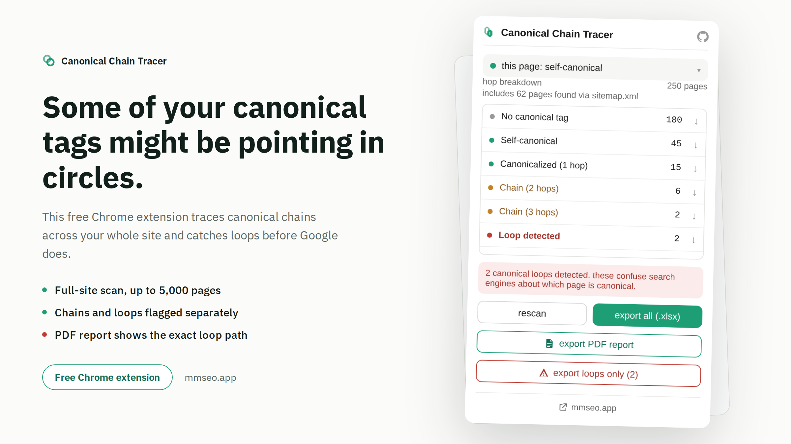

# Canonical Chain Tracer

Full guide and download: https://mmrahmanbappi.github.io/chrome-extensions/canonical-chain-tracer/

A free Chrome extension that checks your canonical tags and finds the ones pointing in circles.

## Why this matters

A canonical tag should point straight to the real version of a page. Sometimes it points to another page, and that page points somewhere else too. That is called a chain. When a chain loops back to where it started, search engines get confused about which page to actually show in results. This tool finds those problems before Google does.

## What it does

- Checks the page you are on right away, no setup needed
- Scans your whole site in one click, up to 5,000 pages
- Reads your sitemap.xml automatically and includes those pages too
- Shows a clear breakdown: no canonical tag, self canonical, chain, or loop
- Flags loops separately and shows you the exact path, so you know what to fix
- Catches pages with more than one canonical tag, which is a common mistake
- Lets you export a PDF report or an Excel file with everything found
- Works in English
- Everything stays in your browser. Nothing is sent to any server

## How to install

1. [Download canonical-chain-tracer.zip](https://github.com/mmrahmanbappi/chrome-extensions/releases/latest/download/canonical-chain-tracer.zip) and unzip it on your computer.
2. Open a new tab in Chrome and go to chrome://extensions
3. Turn on Developer mode, the toggle is in the top right corner.
4. Click Load unpacked and select the canonical-chain-tracer folder.
5. The icon will show up in your toolbar. Pin it so it is easy to find.

## Good to know

- A normal scan covers up to 5,000 pages. Very large sites only get a partial map.
- Only pages on the same domain are checked. Subdomains and outside links are noted but not followed.
- If you close the browser mid scan, your progress is saved. Just open the popup again to pick up where you left off.

## Support

If you run into a bug or have a question, reach out through [github.com/mmrahmanbappi](https://github.com/mmrahmanbappi).

## License

All rights reserved. See [LICENSE](LICENSE). This software is proprietary. The source code may not be copied, modified, or shared without permission.
