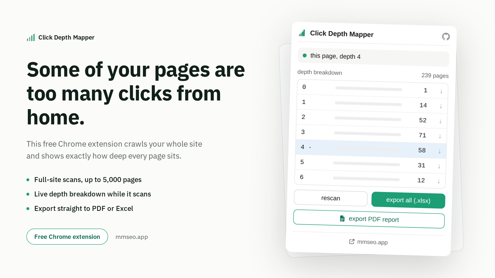

# Click Depth Mapper

Full guide and download: https://mmrahmanbappi.github.io/chrome-extensions/click-depth-mapper/

A free Chrome extension that shows how many clicks away any page is from your homepage.

## Why this matters

The deeper a page sits from your homepage, the harder it is for search engines and visitors to find it. Pages that are three, four, or more clicks deep often get ignored, even if the content is good. Knowing your click depth helps you fix your internal links and give important pages a better chance to rank.

## What it does

- Tracks click depth as you browse, no scan needed, the count updates as you click around
- Scans your whole site in one click, up to 5,000 pages
- Reads your sitemap.xml and includes pages found there too
- Shows a live progress bar with a time estimate while scanning
- Keeps running in the background even if you close the popup
- Saves progress automatically every few seconds, so you never lose your scan
- Lets you pause, resume, or start over anytime
- Gives you a breakdown of how many pages sit at each depth level
- Lets you export a PDF report or an Excel file with the full page list
- Works in English
- Everything stays in your browser. Nothing is sent to any server
- Completely free, no account and no activation code needed

## How to install

1. [Download click-depth-mapper.zip](https://github.com/mmrahmanbappi/chrome-extensions/releases/latest/download/click-depth-mapper.zip) and unzip it on your computer.
2. Open a new tab in Chrome and go to chrome://extensions
3. Turn on Developer mode, the toggle is in the top right corner.
4. Click Load unpacked and select the click-depth-mapper folder.
5. The icon will show up in your toolbar. Pin it so it is easy to find.

## Good to know

- A normal scan covers up to 5,000 pages. Very large sites only get a partial map.
- Only pages on the same domain are checked. Subdomains and outside links are not followed.
- If you close the browser mid scan, your progress is saved. Just open the popup again to pick up where you left off.

## Support

If you run into a bug or have a question, reach out through [github.com/mmrahmanbappi](https://github.com/mmrahmanbappi).

## License

MIT. Free to use, change and share, in personal and commercial projects. See [LICENSE](LICENSE).
