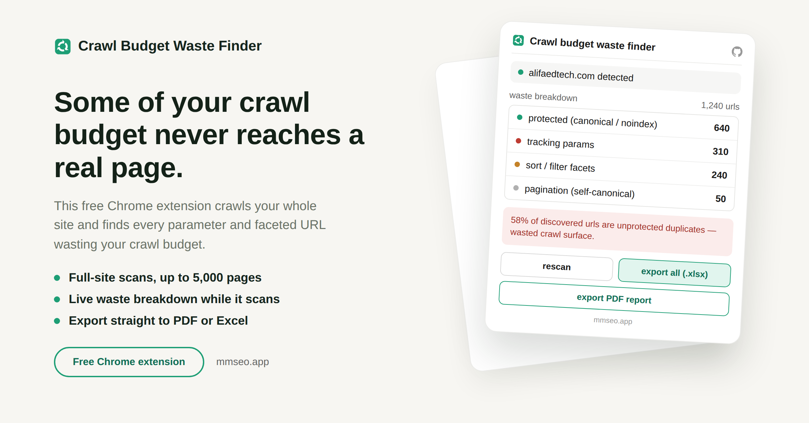

# Crawl Budget Waste Finder

Full guide and download: https://mmrahmanbappi.github.io/chrome-extensions/crawl-budget-waste-finder/

A free Chrome extension that finds URLs on your site quietly wasting your crawl budget, things like sort filters, tracking links, and session IDs.

## Why this matters

Search engines only spend so much time crawling your site. If a lot of that time goes to filter combinations, tracking parameters, or duplicate pages, your real content gets less attention. This tool shows you exactly which of those URLs are already protected with a canonical tag, noindex, or robots.txt rule, and which ones are wide open for a crawler to waste time on.

## What it does

- Detects your site automatically from the tab you have open, no typing needed
- Scans your whole site in one click, up to 5,000 pages
- Sorts every URL with a query string into tracking, sort or filter, or pagination
- Checks each one against its canonical tag, meta robots tag, and robots.txt
- Gives you a simple waste score, the percent of URLs left open for crawlers
- Handles JavaScript heavy pages by opening a hidden tab when needed
- Flags pages blocked by anti bot systems separately, so they do not throw off your numbers
- Keeps running in the background even if you close the popup
- Saves progress automatically, and lets you resume after closing the browser
- Lets you export just one category or everything as an Excel file
- Lets you export a full PDF report
- Everything stays in your browser. Nothing is sent to any server
- Completely free, no account and no activation code needed

## How to install

1. [Download crawl-budget-waste-finder.zip](https://github.com/mmrahmanbappi/chrome-extensions/releases/latest/download/crawl-budget-waste-finder.zip) and unzip it on your computer.
2. Open a new tab in Chrome and go to chrome://extensions
3. Turn on Developer mode, the toggle is in the top right corner.
4. Click Load unpacked and select the crawl-budget-waste-finder folder.
5. The icon will show up in your toolbar. Pin it so it is easy to find.

## What this does not measure

This shows you how much of your site's linked URL space is parameterized and left open to crawlers. It does not show what Google has actually spent crawl budget on. For that, you need your server logs or Google Search Console. Think of this tool as showing you what a crawler could fall into, which is exactly what you need to fix in your robots.txt or canonical tags.

## Support

If you run into a bug or have a question, reach out through [github.com/mmrahmanbappi](https://github.com/mmrahmanbappi).

## License

MIT. Free to use, change and share, in personal and commercial projects. See [LICENSE](LICENSE).
