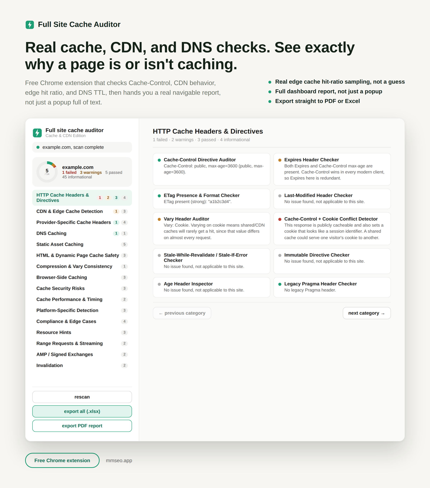

# Full Site Cache Auditor

Full guide and download: https://mmrahmanbappi.github.io/chrome-extensions/full-site-cache-auditor/

A free Chrome extension that runs 54 real checks on your site's caching, CDN, and DNS setup, and reports each one on its own.

## Why this matters

Caching problems are hard to spot by hand. A missing Cache-Control header, a CDN that is not actually caching your pages, or a DNS setup that adds delay, these things quietly slow your site down and can hurt both user experience and rankings. This tool checks all of it at once and tells you exactly where the issues are.

## What it checks

The 54 checks cover several areas:

- HTTP cache headers and directives, like Cache-Control, Expires, and ETag
- CDN and edge cache detection, including which provider you are using
- Provider specific headers for Fastly, Akamai, Cloudflare, Vercel, and Netlify
- DNS caching and TTL behavior
- Static asset caching for images, fonts, and scripts
- HTML and dynamic page cache safety
- Browser side caching, including service workers and PWA setup
- Cache security risks, like cache poisoning
- Cache performance and timing
- Platform specific detection for WordPress, Varnish, Nginx, and Apache
- Resource hints like preload and preconnect
- AMP and signed exchange support

## How to install

1. [Download full-site-cache-auditor.zip](https://github.com/mmrahmanbappi/chrome-extensions/releases/latest/download/full-site-cache-auditor.zip) and unzip it on your computer.
2. Open a new tab in Chrome and go to chrome://extensions
3. Turn on Developer mode, the toggle is in the top right corner.
4. Click Load unpacked and select the full-site-cache-auditor folder.
5. The icon will show up in your toolbar. Pin it so it is easy to find.

## How it works

The tool fetches your homepage, robots.txt, sitemap.xml, and up to 15 internal pages once, then runs every check against that same data instead of fetching things over and over. A full report opens in its own tab with everything organized by category. You can export the results as an Excel file or a styled PDF report.

## Good to know

This tool works in English only. A few things are left out on purpose because there is no reliable way to check them from a browser extension, like Early Hints detection and Cloudflare Page Rules, since neither exposes anything a script can actually read.

## Support

If you run into a bug or have a question, reach out through [github.com/mmrahmanbappi](https://github.com/mmrahmanbappi).

## License

MIT. Free to use, change and share, in personal and commercial projects. See [LICENSE](LICENSE).
