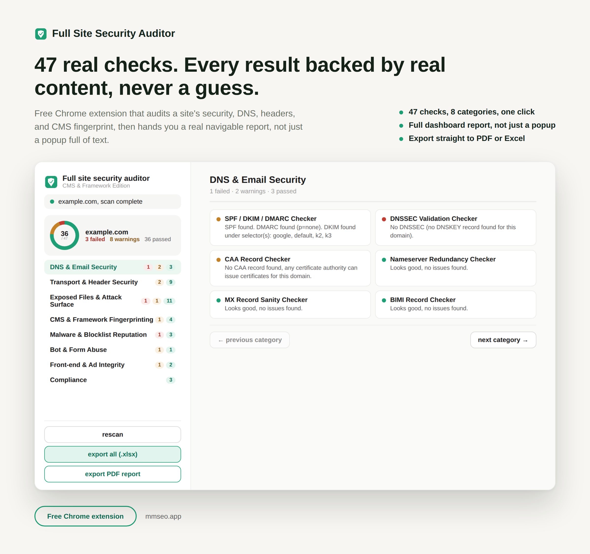

# Full Site Security Auditor

Full guide and download: https://mmrahmanbappi.github.io/chrome-extensions/full-site-security-auditor/

A free Chrome extension that runs 47 security, DNS, and CMS checks on your site and reports each one on its own.

## Why this matters

Security issues often sit quietly until something goes wrong: an exposed config file, a missing security header, an outdated library, or a subdomain that can be taken over by someone else. Most site owners never check for these things because it takes time and know how. This tool runs the full checklist for you and tells you plainly what needs attention.

## What it checks

The 47 checks cover several areas:

- Transport and header security, like HTTPS redirects, security headers, and TLS certificate expiry
- Exposed files and attack surface, like config files, backup files, and admin panels
- CMS and framework detection, including outdated libraries and version leaks
- Malware and blocklist reputation, including hidden spam and cloaking
- Bot and form abuse protection
- DNS and email security, like SPF, DKIM, and DMARC records
- Front end and ad integrity
- Compliance, like privacy policy and cookie consent presence

## How to install

1. [Download full-site-security-auditor.zip](https://github.com/mmrahmanbappi/chrome-extensions/releases/latest/download/full-site-security-auditor.zip) and unzip it on your computer.
2. Open a new tab in Chrome and go to chrome://extensions
3. Turn on Developer mode, the toggle is in the top right corner.
4. Click Load unpacked and select the full-site-security-auditor folder.
5. The icon will show up in your toolbar. Pin it so it is easy to find.

## How it works

This tool is different from the rest of the line. Instead of crawling page by page, it runs a fixed checklist against your site using a handful of targeted requests, a light sample of pages, and some DNS lookups. The homepage, robots.txt, and up to 15 internal pages are fetched once and shared across every check. You can export the results as an Excel file or a styled PDF report.

## Good to know

A few checks are left out on purpose because there is no reliable, free way to run them from a browser extension, such as Google Safe Browsing lookups and raw TLS handshake inspection. Nothing this tool finds is ever actively tested or exploited, it only flags things for you to review. This tool works in English only.

## Support

If you run into a bug or have a question, reach out through [github.com/mmrahmanbappi](https://github.com/mmrahmanbappi).

## License

All rights reserved. See [LICENSE](LICENSE). This software is proprietary. The source code may not be copied, modified, or shared without permission.
