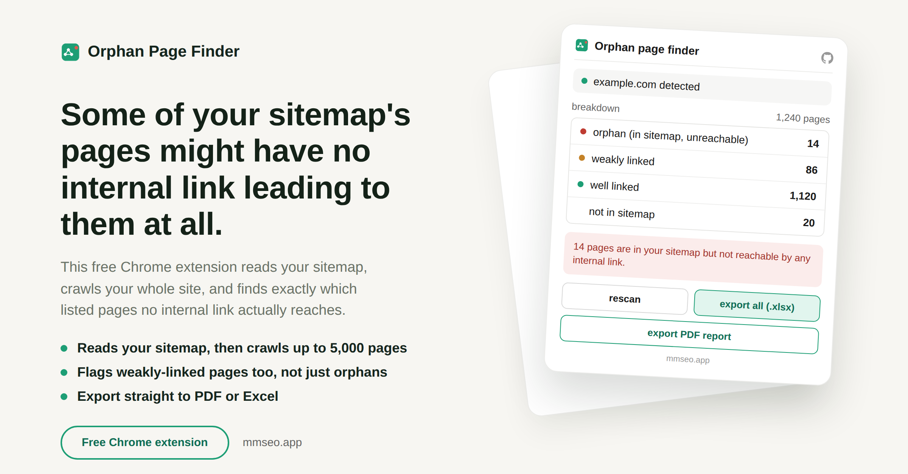

# Orphan Page Finder

Full guide and download: https://mmrahmanbappi.github.io/chrome-extensions/orphan-page-finder/

A free Chrome extension that finds pages in your sitemap that no internal link actually points to, along with pages that are only weakly linked.

## Why this matters

A page can exist and be listed in your sitemap, yet have no internal link pointing to it anywhere on your site. Search engines have a much harder time finding and ranking those pages. This tool checks both your sitemap and your actual internal links, then shows you which pages are truly orphaned, which are only weakly linked, and which pages are linked but missing from your sitemap entirely.

## What it does

- Detects your site automatically from the tab you have open, no typing needed
- Reads your sitemap.xml, including sitemap indexes and gzipped sitemaps
- Scans your whole site in one click, up to 5,000 pages
- Lets you set your own threshold for what counts as well linked
- Gives you four clear groups: orphan, weakly linked, well linked, and not in sitemap
- Marks pages as unconfirmed instead of guessing when a scan runs out of room, so numbers stay honest
- Handles JavaScript heavy pages by opening a hidden tab when needed
- Flags pages blocked by anti bot systems separately
- Keeps running in the background even if you close the popup
- Saves progress automatically, and lets you resume after closing the browser
- Lets you export just one category or everything as an Excel file
- Lets you export a full PDF report
- Everything stays in your browser. Nothing is sent to any server
- Completely free, no account and no activation code needed

## How to install

1. [Download orphan-page-finder.zip](https://github.com/mmrahmanbappi/chrome-extensions/releases/latest/download/orphan-page-finder.zip) and unzip it on your computer.
2. Open a new tab in Chrome and go to chrome://extensions
3. Turn on Developer mode, the toggle is in the top right corner.
4. Click Load unpacked and select the orphan-page-finder folder.
5. The icon will show up in your toolbar. Pin it so it is easy to find.

## One thing this cannot see

A page that is in neither your sitemap nor linked from anywhere on your site is invisible to any tool that only crawls and reads sitemaps, including this one. Finding those pages needs Google Search Console's indexed pages report, since that requires logging into a Google account, which this tool never asks for on purpose. If you need full certainty, check this tool's results against Search Console.

## Support

If you run into a bug or have a question, reach out through [github.com/mmrahmanbappi](https://github.com/mmrahmanbappi).

## License

MIT. Free to use, change and share, in personal and commercial projects. See [LICENSE](LICENSE).
