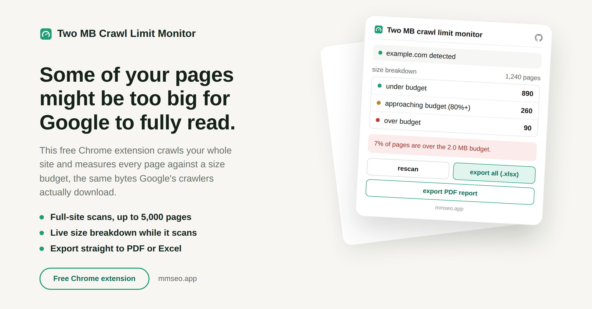

# Two MB Crawl Limit Monitor

A free Chrome extension that finds pages on your site approaching or going over Google's real crawl size limit.

## Why this matters

Google's own documentation says Googlebot only reads the first 2MB of a page, and stops there. If your page is bigger than that, the rest simply never gets crawled or indexed. Most site owners have no idea how close their pages are to this limit. This tool measures the exact bytes a crawler would download, not the total weight of images and scripts a browser loads, and shows you which pages are at risk.

## What it does

- Detects your site automatically from the tab you have open, no typing needed
- Scans your whole site in one click, up to 5,000 pages
- Lets you set your own size budget in MB before scanning
- Sorts every page into under budget, approaching budget, or over budget
- Measures the real response size, the same bytes a search engine actually downloads
- Handles JavaScript heavy pages by opening a hidden tab when needed, without changing how size is measured
- Flags pages blocked by anti bot systems separately, so they do not throw off your numbers
- Keeps running in the background even if you close the popup
- Saves progress automatically, and lets you resume after closing the browser
- Lets you export just one category or everything as an Excel file
- Lets you export a full PDF report
- Everything stays in your browser. Nothing is sent to any server
- Completely free, no account and no activation code needed

## How to install

1. Download the folder and unzip it on your computer.
2. Open a new tab in Chrome and go to chrome://extensions
3. Turn on Developer mode, the toggle is in the top right corner.
4. Click Load unpacked and select the two-mb-crawl-limit-monitor folder.
5. The icon will show up in your toolbar. Pin it so it is easy to find.

## Good to know

- A normal scan covers up to 5,000 pages. Very large sites only get a partial map.
- robots.txt is respected before a page is even fetched, so a huge blocked page never skews your results.
- Pages that Google gives a bigger allowance to, like PDFs, get their own 64MB limit instead of 2MB.

## Support

If you run into a bug or have a question, reach out through [github.com/mmrahmanbappi](https://github.com/mmrahmanbappi).

## License

All rights reserved. See [LICENSE](LICENSE). This software is proprietary. The source code may not be copied, modified, or shared without permission.
